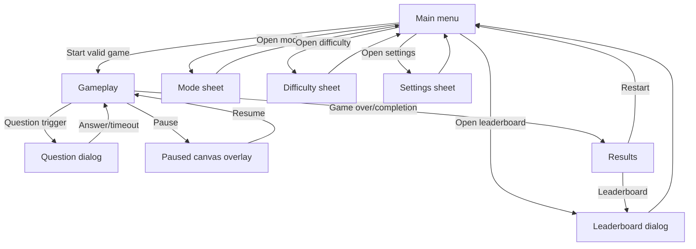

# Kaflul UI Screen Map - Current Production Baseline

Date: 2026-06-28
Scope: Phase 0 screen and component inventory only.

## Screen Inventory

| Screen/state | DOM owner | Main files | Entry | Exit |
| --- | --- | --- | --- | --- |
| Main menu | `#start-screen`, `#player-form.main-menu` | `index.html`, `main-menu.css`, `game.js` | Initial load or restart | Start button submits valid form |
| Mode selection sheet | `#mode-panel.menu-sheet` | `index.html`, `main-menu.css`, `game.js` | Mode control button | Sheet close, selection, outside/escape handling |
| Difficulty sheet | `#difficulty-panel.menu-sheet` | `index.html`, `main-menu.css`, `game.js` | Difficulty control button | Sheet close, selection, outside/escape handling |
| Settings/profile sheet | `#settings-panel.menu-sheet` | `index.html`, `main-menu.css`, `game.js` | Profile control button | Save nickname or close |
| Gameplay | `.stage`, `#game-canvas`, `.hud` | `index.html`, `styles.css`, `arcade-foundation.css`, `game.js` | `startGame` | Win/loss/results or menu restart |
| Question dialog | `#question-dialog.dialog` | `index.html`, `styles.css`, mobile CSS/JS, `game.js` | Collision/question trigger | Submit/correct/timeout/finish |
| Pause overlay | Canvas-rendered overlay | `game.js`, `kaflul-systems.js` | Pause button/keyboard | Resume |
| Results | `#end-screen.screen` | `index.html`, `styles.css`, `game.js` | Game over/completion | Restart or leaderboard |
| Leaderboard | `#leaderboard-dialog.leaderboard-dialog` | `index.html`, `leaderboard.css`, `game.js`, `api/champions.js` | Menu/results/HUD leaderboard buttons | Close |

## Component Inventory

### Main Menu

Components:

- Decorative world background: `.menu-world`, `.menu-enemy`, `.menu-particle`.
- Best-score card: `.menu-best-card`, `#menu-best-score`.
- Official logo: `.menu-logo`, `.menu-logo-image`.
- Top action buttons:
  - `#leaderboard-open`
  - `#menu-sound-button`
  - `#menu-settings-button`
- Character radio group:
  - Bifly: `input[name="character"][value="bifly"]`
  - Nabatick: `input[name="character"][value="nabatick"]`
- Leaderboard preview:
  - `#menu-rank-value`
  - `#menu-personal-best`
  - `#menu-next-rank`
  - `#menu-leaderboard-link`
- CTA:
  - `#start-button`
  - `#menu-selection-summary`
- Control strip:
  - `#mode-control-button`, `#selected-mode-label`
  - `#difficulty-control-button`, `#selected-difficulty-label`
  - `#profile-control-button`, `#selected-profile-label`

Current default baseline:

- Character: Bifly.
- Mode: Arcade.
- Difficulty: Normal.
- Selection summary: `ביפלי · רגיל ×1.5 · ארקייד`.

### Mode Sheet

Components:

- `#mode-panel`
- Close button: `[data-close-panel]`
- Radio group: `input[name="game-mode"]`
- Options:
  - `arcade`
  - `adventure`

State handling:

- `setMode` updates `state.modeId`, save/settings, labels, summary, and difficulty availability as needed.

### Difficulty Sheet

Components:

- `#difficulty-panel`
- Close button: `[data-close-panel]`
- Radio group: `input[name="difficulty"]`
- Options:
  - `beginner`
  - `normal`
  - `advanced`
  - `expert`
  - `legendary`

State handling:

- `setDifficulty` updates `state.difficultyId`, storage, summary, and leaderboard preview.
- Legendary lock/unlock rules must remain in system logic.

### Settings/Profile Sheet

Components:

- `#settings-panel`
- `#player-name`
- `#settings-save-button`
- Nickname/help text.

State handling:

- Nickname is validated and saved through existing persistence paths.
- Must not break local save schema or leaderboard publishing.

### Gameplay HUD

Components:

- Answer count: `#answers-count`
- Level: `#level-label`
- World: `#world-label`
- Score: `#score-label`
- Mode: `#mode-label`
- Difficulty: `#difficulty-label`
- Combo: `#combo-label`
- Lives: `#lives-label`
- Mission/progress elements.
- Buttons:
  - Sound
  - Pause
  - Leaderboard

State handling:

- HUD values are updated by `game.js`.
- HUD visibility is governed by `html[data-game-state]`, menu/results/leaderboard state, and mobile hotfix classes.

### Canvas Gameplay

Component:

- `canvas#game-canvas`, intrinsic size `960x720`.

Gameplay responsibilities:

- Maze drawing.
- Character/enemy drawing.
- Collision and question triggers.
- Pause overlay drawing.
- Results transition.

Preserve:

- Rendering scale and input mapping.
- Existing movement and enemy behavior.
- Existing canvas-based pause overlay until intentionally replaced in a later phase.

### Question Dialog

Components:

- `#question-dialog`
- `#question-text`
- Timer/progress elements.
- `#answer-input`
- Submit button.
- Feedback region.

State handling:

- `askQuestion` opens the dialog and starts timer/focus flow.
- `finishQuestion` closes and resolves gameplay state.
- Mobile scripts mirror state and keep native input behavior.

### Results Screen

Components:

- `#end-screen`
- Score/performance labels.
- Publish score panel.
- Restart button.
- Leaderboard button.

State handling:

- Populated after game completion.
- Writes best score and leaderboard entries through existing systems.

### Leaderboard Dialog

Components:

- `#leaderboard-dialog`
- `#leaderboard-refresh`
- `#leaderboard-close`
- `#leaderboard-mode-filter`
- `#leaderboard-difficulty-filter`
- `#leaderboard-list`
- `#leaderboard-status`

State handling:

- Local leaderboard filter/sort is tested in `kaflul-systems.test.js`.
- Remote champion API exists in `api/champions.js`.

## State Transition Map

## JavaScript Ownership Map

| Concern | Current owner |
| --- | --- |
| Player character config | `PLAYER_CHARACTERS` in `game.js` |
| Image object creation | `GAME_ASSETS` in `game.js` |
| Character persistence | `setCharacter`, storage keys, save settings |
| Mode persistence | `setMode`, storage keys, save settings |
| Difficulty persistence | `setDifficulty`, systems difficulty config |
| Menu labels | `syncMenuSummary`, menu update helpers |
| Menu sheets | `openMenuSheet`, `closeMenuSheets` |
| Start flow | `startGame`, `player-form` submit listener |
| Question dialog | `askQuestion`, `finishQuestion`, mobile question/native scripts |
| Pause | `togglePause`, systems state machine |
| Results | `showEndScreen`, score/leaderboard helpers |
| Leaderboard | `loadLeaderboard`, `publishScore`, leaderboard filters |
| Sound | `toggleSound`, `playTone` helpers |
| Runtime mobile classes | `mobile-enhancements.js`, `mobile-screen-state.js`, `mobile-question-state.js` |
| Nabatick sprite substitution | `nabatick-directional.js` |

## Preserve Checklist

- Existing save keys and save migration.
- Existing localStorage values.
- Existing leaderboard data format.
- Existing mode/difficulty IDs.
- Existing character IDs: `bifly`, `nabatick`.
- Existing canvas dimensions and gameplay coordinate assumptions.
- Existing keyboard/touch controls.
- Existing question answer behavior.
- Existing score/combo/lives progression.
- Existing pause behavior.
- Existing sound toggle behavior.

## Screen-Specific Risks

| Screen | Risk |
| --- | --- |
| Main menu | Heavy final CSS layer, character visual clipping, Unicode icons, mobile landscape compression. |
| Mode sheet | Dialog/focus behavior not fully covered by tests. |
| Difficulty sheet | Legendary availability must remain tied to save/progression logic. |
| Settings sheet | Nickname validation must remain compatible with leaderboard publishing. |
| Gameplay | Canvas and HUD share responsive space; avoid changing gameplay coordinate behavior. |
| Question dialog | Mobile native answer input is fragile and protected by multiple hotfix files. |
| Pause overlay | Canvas-rendered state can be broken by rendering refactors. |
| Results | Tightly coupled to scoring and leaderboard updates. |
| Leaderboard | CSS class overlap with menu action buttons. |

## Phase 1 Foundation Updates

The current screen map remains valid after Phase 1. No new production screen was introduced.

New foundations:

- `ui/foundation.css` provides reusable button, panel, dialog, sheet, badge, navigation, progress, and HUD primitives for later migration.
- `ui/icons.svg` provides the icon sprite used by menu/HUD/leaderboard controls.
- `ui/assets/asset-manifest.js` records the current production asset set without changing gameplay loading.
- `ui/mobile-overrides.css` owns the top-level mobile CSS boundary while preserving the original mobile hotfix order.

Updated UI ownership:

| Concern | Phase 1 owner |
| --- | --- |
| Design tokens | `ui/foundation.css` |
| Component primitives | `ui/foundation.css` |
| Reduced-motion primitives | `ui/foundation.css` |
| SVG icon symbols | `ui/icons.svg` |
| Current asset inventory runtime manifest | `ui/assets/asset-manifest.js` |
| Mobile hotfix cascade boundary | `ui/mobile-overrides.css` |
| Visual regression and smoke acceptance | `tools/phase1_visual_regression.mjs` |

The visible screen hierarchy remains intentionally close to the Phase 0 baseline. Phase 2 is still responsible for home hub redesign.
